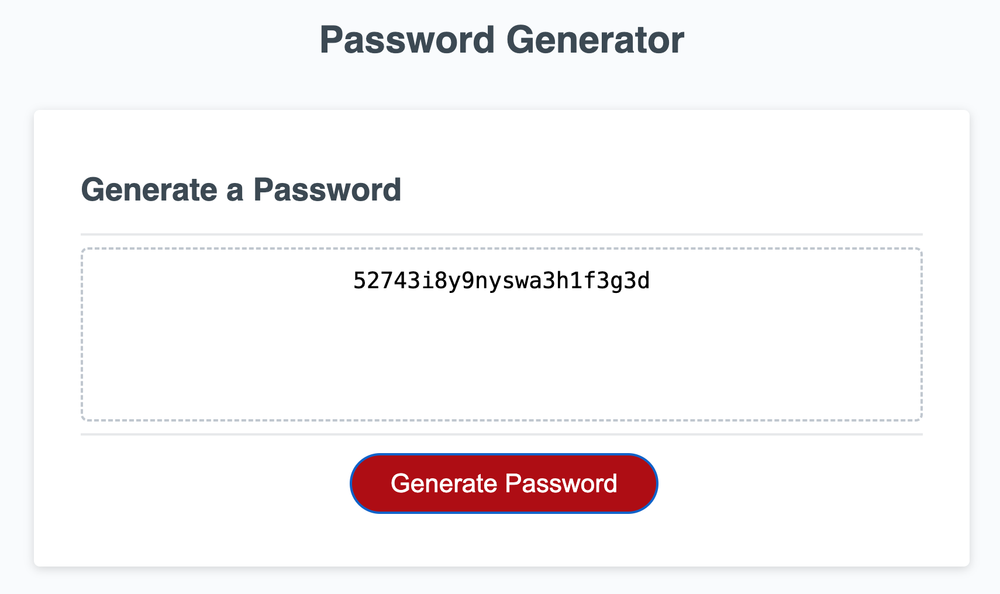

# password-generator

## Description
Generates a random password based on selected criteria

https://jessicadubina.github.io/password-generator/

## Installtion
N/A

## Usage

Example of a generated password based on the provided criteria inputs

## Credits
Ficher-Yates shuffle algorithm was used to randomize the character placements within the new password.

    function shuffle(arr) {
        let currentIndex = arr.length,  randomIndex;
        while (currentIndex > 0) {
        randomIndex = Math.floor(Math.random() * currentIndex);
        currentIndex--;
        [arr[currentIndex], arr[randomIndex]] = [
            arr[randomIndex], arr[currentIndex]];
        }
        return arr;
    } 
https://en.wikipedia.org/wiki/Fisher%E2%80%93Yates_shuffle

## Licence
Please refer to license attached to the project.